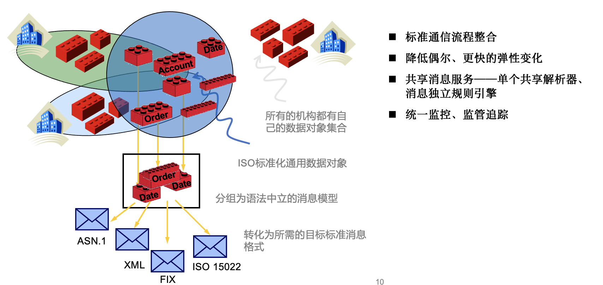
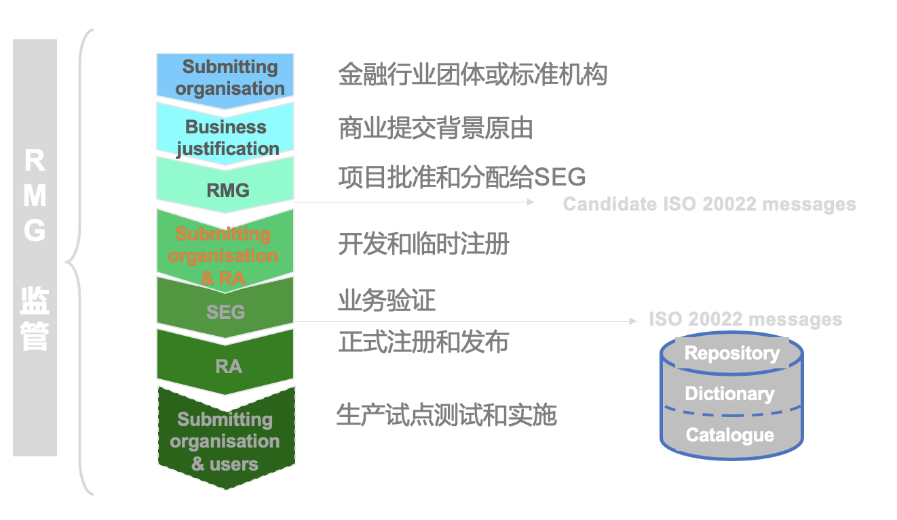

[[toc]]

## 1.什么是ISO20022 标准

> ​    ISO 20022 是一种新兴的**全球开放式支付消息传递标准**。一种为全球支付数据创建的通用语言和模型，一种提供笔其他标准更高质量的数据，这意味着所有人都能够获得更高质量的付款。一种可以适应新需求和新方法的产品。一个不受单一利益控制的标准。一种可供业内任何人使用并在任何网络上实施的工具。

我们将从ISO20022是什么以及为何可以在各平台机构中流行起来，它的诞生是传递了怎样的一种价值观，或者说解决了哪些行业问题。

然后再看看这个标准如何成功传递信息，有哪些机构平台参与了该标准的制作，到目前为止该标准涵盖的行业范围。

同时，随着行业发展，有新的内容产生时，如何将这些新兴内容添加到该标准中，这就是该标准的注册流程。后面会提到该标准最终实时落地方案是一个标准xml, ANS存储库。

在这里我们可以看到通用、信息标准传递。如果我们可以在所有支付通信中使用单一的消息标准，那么我们就可以节约很多兼容标准不一样所浪费的时间和精力。

+ 无论交易对手方是谁？金融机构、金融信息机构商、对私、对公客户都可以使用同一套标准，

+ 无论是哪个业务领域？(支付行业、证券行业、贸易服务、发卡行、外汇等)都是可以的，

+ 无论是哪个网络？(公网、私网、国内或者国际)都如此。

## 2.价值体系

### 2.1 解决痛点

接下来是ISO 20022 的价值体系和解决痛点问题。

ISO20022旨在实现金融机构及其市场基础设施和最终用户社区之间通信互操性。

并且解决许多对于XML金融消息标准重叠化问题。指定所有金融财务标准都是用单一标准化方法，这套标准包括使用方法、指定流程、标准词典存储库等。

从这里我们可以看到从本世纪初所流行通信方法。并且都是使用XML方式。

有一个问题是：XML并不是一种语言，而是一种元语言。也就是说通过XML标准格式每个人可以定义自己的“方言”。那么这就导致出现了很多种“方言”，并且当多个“方言”专注于同一个领域时，势必会造成资源浪费，重复定义，并且也会进一步增加分歧风险。

> + MDDL: Market Data Definition Language 市场数据定义语言，是一种基于XML的消息格式，用于交换与金融工具、市场数据相关信息，由SIIA(Software & Information Industry Association 软件信息产业协会 ) 和 FISD(Financial information services division 金融信息服务部) 开发，2000年得到使用，并且获得全行业认可。
> + FIX: Financial information eXchange 金融信息交换协议 1992年发起的电子通信协议，用于与证券交易、市场相关的国际实时信息交换。
> + VRXML: Vendor Reporting Extensible Markup Language 供应商报表协议 是一种基于XML 涉及市场数据计费、报表、库存管理等。最初由纽交所开发，目的是使所有部分能够以通用XML格式生成、传输、接收和处理发票和报表。

上述数层间金融行业事业的一些标准协议。

### 2.2 ISO20022 解决方案

为了解决上述的行业“方言”痛点问题，在此ISO给出了建议的解决方案：

所有金融标准计划都使用单一标准方法。

为了解决这个问题，ISO提出：

+ 一个通用的开发方法
+ 一个通用的流程
+ 一个通用的存储库供所有金融标准计划使用。

这便是ISO 20022.

如果所有的金融财务标准都是用该套配方，我们将避免重复工作、并且所有的开发通信消息就减少了沟通分歧产生，看起来就像是同一个开发人员开发一样。

### 2.3 长期趋同 短期共存

+ 趋于同一个标准是一个长期目标
+ 多项标准共存，快速适应市场竞争压力和响应监管要求
+ 多标准如何“短期”共存

最终金融行业趋于同一个标准是一个长期目标

但是在此期间，和现有标准需要共存，以快速适应市场竞争压力和响应监管要求。

ISO20022 不仅提供了一种趋于同一标准的长期目标的方法，同时还提供了一种促进多种标准“短期”共存的方法。

目前已经存在了很多标准，并且当标准彼此独立开发时，从一种标准到另外一种标准的转换需要将数据直接从一个应用映射到另外一个程序，这是一种高成本、不可扩展、难以维护和试试的方案。

### 2.4 降低复杂度

每当我们需要支持新的标准时，都会城北的增加复杂性和成本的。

在此我举个栗子：

我们有7个标准，每个标准需要与其他6个标准中的每一个来回通信。我们就需要7*6=42个接口来翻译报文。

但是，如果我们增加标准的数量，比如增加3个标准，我们总共有10个标准，每个标准都需要与其他9个标准进行通信。

那么此时我们需要10*9=90个翻译接口。

对于我们7个标准中的每一个都使用了单个消息模型，只需要将其转化一次到消息模型中，然后从另外的消息模型中进行接收。

换句话说，我们只需要为每个标准开发两个翻译接口就行了 （适配器模式）

### 2.5 流程整合

+ 标准通信流程整合
+ 降低偶尔、更快的弹性变化
+ 共享消息服务——单个共享解析器、消息独立规则引擎
+ 统一监控、监管追踪

从上面我们可以得知，标准实施可以降低成本，实现适应更快的弹性变化，以便提高整体的性能。

这种开发独立于语法的业务模型的方法是ISO20022标准的核心。

从长远来看，从模型生成的物理ISO20022消息将成为我们正在寻找的唯一标准，

在此之前，多种消息标准模型短期共存，长期趋同。

## 3.ISO20022介绍

这种图说明业务建模概念

每个机构都有自己一套内部数据对象来表达各种业务概念。ISO20022的目标是识别和标准化机构之间共享的概念，并将其存储在ISO 20022存储库的数字词典中。

在这里使用彼此之间商定的标准，就像乐高积木一样，开发人员可以构建与ISO20022语法无关的消息模型，然后根据所需的语法将其转换成目标消息格式。

当前首选的 ISO 20022 语法是 XML 和 ASN.1，但如果选择新的更好的语法，则不需要更改模型：只有将消息模型转换为所需消息格式的规则才会更改。此外，如果针对特定业务领域或特定细分市场使用另一种语法更有效，则使用 ISO 20022 消息模型可确保业务信息从一个消息顺利流向另一个消息，无论使用哪种语法传输该消息商业信息。

独立于语法的业务建模是 ISO 20022 标准的关键……

模型随着业务的发展而发展，而格式随着技术的发展而发展，以从自动化、易于实施、产品的开放性和廉价性等方面的最新创新中受益。 ISO 20022 配方提供了一种更好、更便宜和更快的方式开发和实施可互操作的消息标准。

### 3.1 设计理念

+ 基于建模的标准开发
    - 独立于语法的业务标准
     - 经过行业验证
+ XML和ASN.1 的特定语法的设计规则
    - 可预测和自动化
    - 保护标准免受技术发展的影响 
+ 逆向工程方法
    - 保护行业投资并简化互操作性
    - 为未来的迁移做准备

现在我们看到的是ISO20022的主要内容。详细说一下各项是代表含义：

​    独立于语法的业务建模方法是该标准最具创新性的特征。

​    这种建模方法允许开发人员在未来消息的物理格式之前并独立于其捕获“业务标准”。建模方法提出了一种两步法。

首先，开发者会描述整体的“业务模型”：谁是参与者，他们完成什么样的流程，他们需要什么样的信息来完成这些流程等。

一旦完成，他们将定义最佳的交易流程在正确的时间向正确的参与者传达所需的信息。

在接受之前，候选的 ISO 20022 模型由 ISO 提名的行业未来用户代表进行验证。这是为了在 ISO 20022 存储库中发布消息之前获得未来用户的支持。

ISO 20022 的另一个主要组成部分是它的一组预先商定的设计规则，用于将消息模型转换为所需语法的物理消息格式——目前是 XML 或 ASN.1。这些设计规则确保所有 ISO 20022 XML 或 ASN.1 模式的结构一致，以一种对接收者（和应用程序供应商）“可预测”的方式进行，从而更容易实现自动化。

语法设计规则与建模方法明确分离的事实确保了当/如果找到新的更好的语法解决方案时不需要更改模型。

此外，该标准的一部分是“逆向工程”技术，用于“重新捕获”现有不符合 ISO 20022 的消息标准的功能，并将其提供给 ISO 20022 模型，从而促进现有消息的互操作性、共存和迁移。他们符合 ISO 20022 的等效标准。

正是业务建模和逆向工程的结合使得 ISO 20022 在支持互操作性方面如此独特。

### 3.2 注册流程

+ 开发注册流程
    - 明确识别活动和角色
    - 业务专家和未来用户提前参与
    - 技术参与
+ ISO20022 标准存储库
    + 业务流程目录和存储库
    + 官方标准之外由注册机构维护

上面提到的是ISO20022的价值，在此再说说ISO20022 的另外两个部分，注册过程和仓储库。

+ ISO20022描述了一个严格的注册过程，以避免重复工作并且确保开发的准确性。业务专家和未来潜在用户提前参与进来，以确保满足所有业务需求。

社区的这种参与可能需要时间，但对于获得良好的标准、将要使用的标准来说绝对是至关重要的。

+ ISO 20022 框架的基石是其财务存储库，其中存储了批准的模型、交易、消息及其组件。

数据字段包含了模型和消息格式。消息格式包含了所有使用的组件，以及包含业务模型、事务和消息的业务流程目录。

一旦业务理由获得 RMG 批准，并且只要消息尚未获得 SEG 批准，这些消息就称为“候选 ISO 20022 消息”。 一旦获得 SEG 批准发布，这些消息就称为“ISO 20022 消息”或“符合 ISO 20022 的消息”。

+ **RMG 注册管理组**
    + 批准新消息标准的商业理由
    + 批准新成员实体
    + 创建标准评估组 (SEG) 和 SubSEG

+ **标准评估组、SEG 和 SubSEG**
    + 代表特定金融领域的未来用户
    + 验证新的候选消息和变更请求

> **注册管理组** **(RMG- Registration Management Group)** **是最高注册机构**。它由资深的行业专家组成，他们共同代表了金融行业的各个领域。 RMG 的作用是促进和支持金融服务参与者的参与，以促进高质量的全球相关 ISO 20022 合规商业模式的注册和维护，以交换金融服务的信息。其使命是确保 ISO 20022 是一个值得信赖的标准，为金融服务信息交换提供高质量的商业模式。
>
> RMG 监督整个注册过程，包括其他注册机构的表现。如果无法达成共识，或者参与过程的各方之间存在冲突，则它充当“上诉法院”。
>
> RMG 评估并优先考虑由希望开发新 ISO 20022 消息的提交组织引入的业务理由。它批准了希望参与 RMG、SEG/SubSEG 和 TSG 的新成员实体的申请。
>
> RMG 还发起创建新的标准评估组 (SEG) 和 SubSEG。
>
> 包括 SUBSEG 在内的标准评估组 (SEG) 是行业专家组，每个专家组代表特定金融领域中 ISO 20022 消息的（未来）用户。他们的作用是确保候选 ISO 20022 消息真正满足未来用户的需求。所有候选 ISO 20022 消息都由一个或多个 SEG 验证，具体取决于消息的范围。 SEG 还批准对现有消息的更改。
>
> 注册机构 (RA) 是 ISO 20022 财务知识库的守护者。 SWIFT 已被 ISO 提名提供 RA 服务。 RA 的作用是指导提交组织，确保开发的模型符合 ISO 20022 技术规范，并将消息模型转换为兼容的 XML 或 ASN.1 模式。 RA 还负责维护 [ISO 20022 网站](www.iso20022.org) 并定期发布 ISO 20022 存储库的更新摘录。
>
> 最后，技术支持组 (TSG) 是一组技术专家，可以帮助任何其他注册机构和提交组织解决与 ISO 20022 配方的使用相关的技术问题。

### 3.3 参与机构

RMG 包括大量成员实体（国家和组织），表明了社区对 ISO 20022 的兴趣。

+ **参与国家**
    + AT, AU, BR, CA, CH, CN, DE, DK, FI, FR, GB, IN, IT, JP, KR, NL, NO, SE, SG, US, ZA. 
+ **参与机构组织**
    + ACTUS, Bank of England, CFTC, Clear stream, DTCC, ECB, EPC, Euroclear, FPL, ISDA/FpML, ISITC, MasterCard, NACHA/IFX, nexo, OMG, SWIFT, Ripple Net, VISA
+ **会议频次**
    + 一年两次
+ **重大决策**
    + 创建六个标准评估组(SEG):
        + 2005 年的支付和证券
        + 2006 年的贸易服务和外汇
        + 2008 年的卡和相关零售金融服务
        + 2016 年的衍生产品 Sub SEG
    + ISO 20022 报文开发项目的批准
    + 批准新的 ISO 20022 成员实体

## 4 .参考链接

+ [About ISO 20022](https://www.iso20022.org/about-iso-20022)

+ [SWIFT-What is ISO 20022](https://www.swift.com/standards/iso-20022)

+ [Catalogue of Message](https://www.iso20022.org/iso-20022-message-definitions)

+ [ISO 20022 message definitions](https://www.iso20022.org/iso-20022-message-definitions)

+ [FIX-Financial Information eXchange](https://en.wikipedia.org/wiki/Financial_Information_eXchange)

+ [MDDL-Market Data Definition Language](https://en.wikipedia.org/wiki/MDDL)

+ [VRXML-Vendor Reporting Extensible Markup Language](https://www.nyse.com/market-data/vrxml)

+ [金融服务 金融业通用报文方案 第5部分：反向工程](http://std.samr.gov.cn/gb/search/gbDetailed?id=5DDA8B9DB2EE18DEE05397BE0A0A95A7)

+ [什么是ISO 20022](http://iso20022.tech/article/iso200224dummies1)

+ [金融服务 金融业通用报文方案 第2部分：UML概况](http://std.samr.gov.cn/gb/search/gbDetailed?id=5DDA8B9D9F1B18DEE05397BE0A0A95A7)

+ [金融服务 金融业通用报文方案 第3部分：建模导则](http://std.samr.gov.cn/gb/search/gbDetailed?id=5DDA8B9DA93418DEE05397BE0A0A95A7)

+ [ISO 20022标准在中国金融业的应用](https://www.cfstc.org/jinbiaowei/2929546/2929550/2968504/index.html)

+ [中国金融业通用报文库](https://www.cufir.org.cn/cufir/index.html)

      

