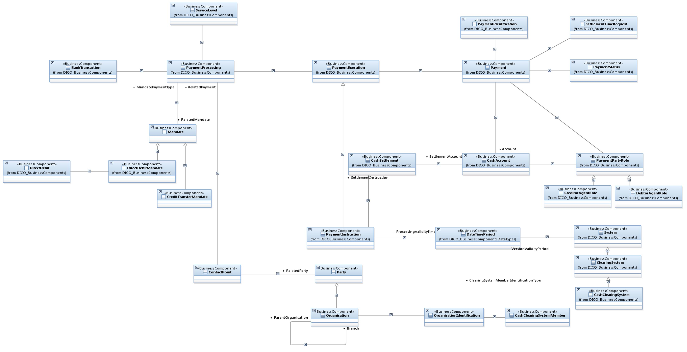
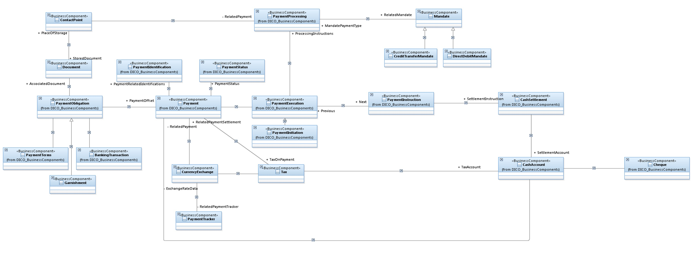
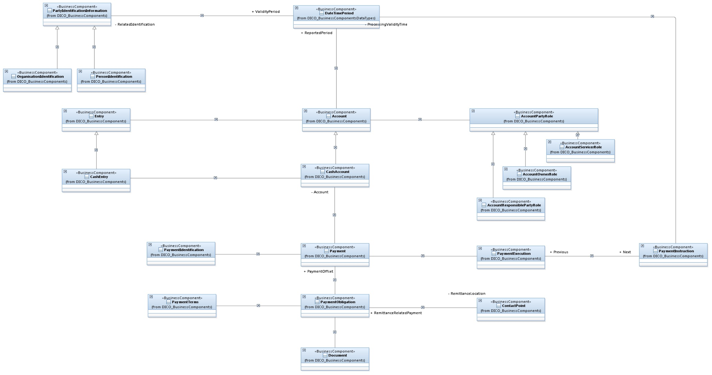

[[TOC]]]

## 1.消息模型

在ISO上下文中，该标准描述了赖以表达信息的协议，而语法是用表达信息的格式或者语言。消息定义提供了对可在各方之间交换的信息和数据格式，包括字段长度、代码、字符集等分类。

ISO 20022消息可用于完整的端到端支付，包括客户—银行(支付)、银行—银行(支付清算与结算)等，这些金融消息定义分为多个业务领域。同时是由4个业务领域代码来标志。

+ acmt—Account Management 账户管理
+ camt—Cash Management 现金管理
+ pain—Payments Initiation 支付发起
+ pacs—Payments Clearing and Settlement 支付清算与结算
+ reda—Reference Data 参考数据
+ remt—Payments Remittance Advice 付款汇款建议
+ 等等标准可以查看[ISO 20022 Business Areas](https://www.iso20022.org/sites/default/files/documents/D7/ISO20022_BusinessAreas.pdf)

## 2.支付发起—pain(Payments Initiation)

## 3.支付清算与结算—pacs(Payments Clearing and Settlement) 

## 4.现金管理—camt(Cash Management)-(Notification To Receive)

## 5.参考连接
+ [ISO 20022 Payment Guide](https://www.finanssiala.fi/wp-content/uploads/2021/03/ISO20022_Payment_Guide.pdf)
+ [ISO 20022 Business Areas](https://www.iso20022.org/sites/default/files/documents/D7/ISO20022_BusinessAreas.pdf)