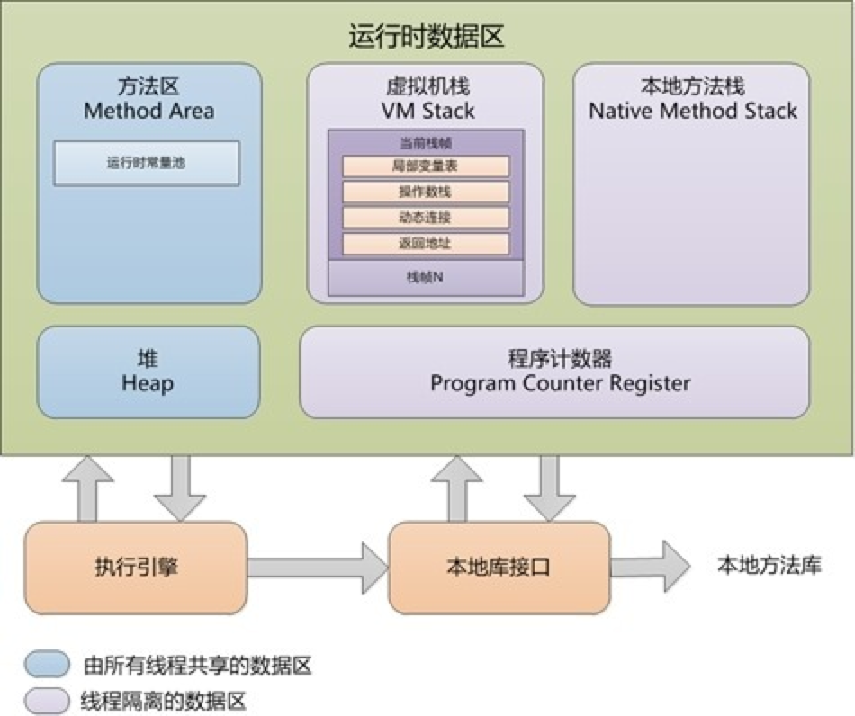
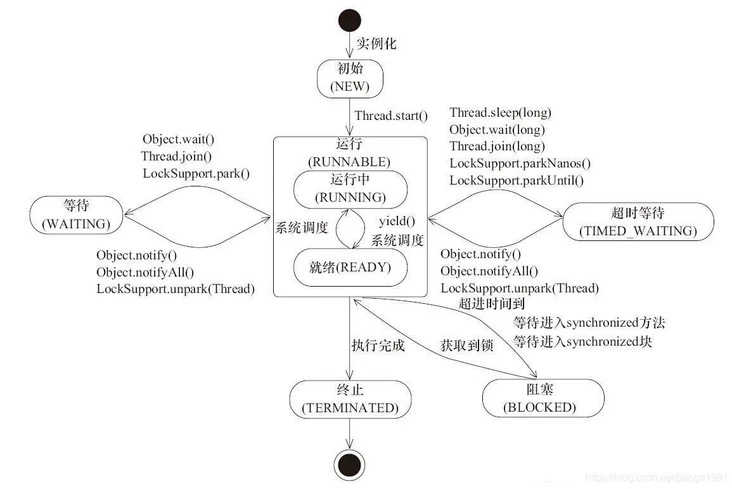

## 笔试题(牛客网)
给定一个房间连接,准时参加牛客网面试题笔试。
+ leetcode [144-二叉树的前序遍历](https://leetcode-cn.com/problems/binary-tree-preorder-traversal/)
+ 牛客网 [求二叉树的前序遍历](https://www.nowcoder.com/questionTerminal/501fb3ca49bb4474bf5fa87274e884b4)

## 技术面
  ### 首先是简单的自我介绍

  面试官会根据简历和自我介绍内容进行提问，找到一个切入口。
  首先是提问Java的一些内容。

  ### JVM内存模型知道吗？说一下你对JVM内存模型的理解。

  主要有一个图很经典。脑海里面要有这个图。
  
  class文件->类加载器(classloader)->加载这个图,哪些内存区间是私有独立的，哪些是线程共享的。

  ### Java类加载器

  主要从类加载流程(加载、验证、解析、初始化)几个过程说一下。
  继续说一下经典的双亲委派模型(Bootstrap ClassLoader、Extension ClassLoader、Application ClassLoader、Custom ClassLoader)等,这几个加载器有一个图很经典脑海里面得有印象。
  还有双亲委派模型的优势是哪些？
  线程上下文加载器是如何对双亲委派模型进行破坏的。

  ### 说一下HashMap初始化的时候16和0.75是指什么
   + capacity 即容量，默认16。
   + loadFactor 加载因子，默认是0.75
   + threshold 阈值。阈值=容量*加载因子。默认12。当元素数量超过阈值时便会触发扩容。
  
  这个要说一下HashMap的扩容机制。
   + 什么时候触发的扩容
   + JDK7中的扩容机制、元素迁移
   + JDK8中的扩容机制、元素迁移
  然后还可以扩展说一下HashMap的底层原理、数据结构。

  ### 线程的几个状态

  这个脑海里面也有个线程生命周期的图。New、Runnable、Running、Terminated、Timed_Waiting、Blocked、Waiting等。
  
  在线程转移图中的各个状态是如何跃迁转移的。涉及到哪些方法，在什么时候触发。

  ### 说说你对线程池的了解

  几个固定的创建方法、七大核心参数、四个拒绝策略这些都是需要提出来的。
  + ExecutorService中四大线程池创建方法，各自应用场景。
  + 线程池七大参数:`corePoolSize` `maximunPoolSize` `keepAliveTime` `unit` `workQueue` `threadFactory` `handler`
  + 四大拒绝策略: `AbortPolicy` `DiscardPolicy` `DiscardOldestPolicy`  `CallerRunsPolicy`

## 业务技术面
## 技术总监面
## HR面试

