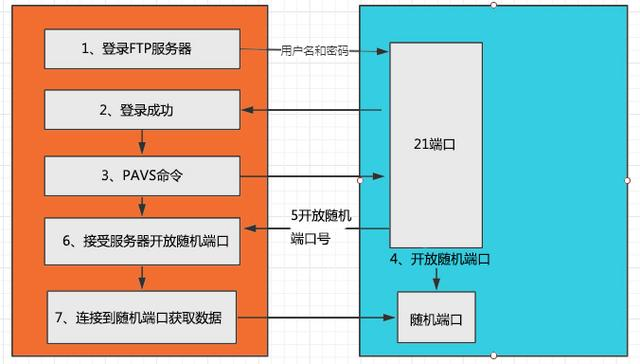

### **简单说下SFTP和FTP区别**

由于目前是做的支付行业项目，涉及到银行出入款项目可能会文件服务器，所以算是一个简单的开场问题。

ftp和sftp都是日常工作中常用的文件传输方式。

#### FTP

- 需要使用客户端和服务端进行交互。服务端用来存储文件，客户端可以使用FTP协议访问服务端上的资源。

- 默认开放21、20两个端口。21端口用于传输控制类消息，20端口是否使用取决于传输模式：被动模式(Passive)和主动模式(Port)。当然如果使用被动模式，具体使用哪个端口需要客户端和服务端双方协商。

- **主动模式**

    

    FTP客户端和服务器首先通过Port 21端口进行建立连接，通过这个通道发送命令。客户端需要接受数据时在此端口上进行Port命令。Port命令包含了客户端用什么端口进行接受数据，在传输数据时服务器端通过自己的TCP21端口连接到客户端指定的端口进行发送数据。

- **被动模式**

    

    建立通道与主动模式相似，建立之后是Pasv命令。服务器收到呢Pasv命令后随机打开一个高端端口(大于1024)并且通知客户端在这个端口上进行请求，客户端连接FTP服务器此端口，通过三次握手进行建立通道，然后服务器通过这个端口进行数据的传输。

- 注意有防火墙的限制，很多防火墙限制了从外部访问发起的连接，所以防火墙和内网中的FTP很多都是不支持Pasv模式的，因此客户端无法通过防火墙来打开一个高端端口。然后很多内网的客户端无法使用Port模式进行登录FTP服务器，因为从服务器的TCP 20端口无法和内网的客户端建立一个新的连接。

#### SFTP

然后SFTP是SSH FIle Transfer Protocol，安全的传输协议。同样FTP和SFTP有种相同的语法和功能。SFTP为SSH的其中一部分，是一种传输档案至服务器的安全方式。其实在SSH软件包中，已经包含了一个叫作SFTP的安全文件信息传输子系统，SFTP本身没有单独的守护进程，它必须使用sshd守护进程(端口号默认是22)来完成相应的连接和答复操作，所以从某种意义上来说，SFTP并不像一个服务器程序，而更像是一个客户端程序。

#### 两者区别

+ **连接方式:** FTP使用TCP端口21来和服务器端进行连接，SFTP是在客户端和服务端之间通过SSH协议(TCP22端口) 建立安全连接来传输文件。
+ **安全性:** SFTP使用加密传输认证信息和传输数据，所以SFTP相对FTP安全。
+ **效率：** SFTP传输方式使用了加密技术，所以传输效率相对普通FTP要低一些。

对于这个文件，最开始有些懵，所以就简单的介绍了一些FTP的主动、被动模式的工作流程，然后说一下SFTP是一种基于ssh安全认证的加密传输模式。然后说了一下两者在连接方式流程上、安全性上、工作效率上的不同，主要就说了这些内容。

然后就开始问到了JUC了，下面就开始了

### 线程状态

支付业务当中肯定会有线程的操作，那你简单说一下线程的状态是怎样的。

### synchronized加锁方式和底层原理

### wait() sleep() 区别 

### 线程池有哪些,自定义线程池需要哪些内容
   四大线程池、七大参数、拒绝策略、工作队列有哪些

### 线程池的数据结构

### 队列平时如何使用,使用场景

### synchronized和lock区别 

### 数据库事务和事务的隔离界别

### 泛型擦除

### 自定义注解及注解上参数的使用含义
